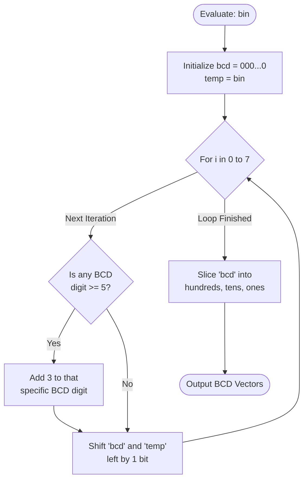
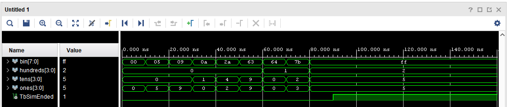

# BIN2BCD Component

The `bin2bcd` component is a purely combinational module that converts an 8-bit binary value into three 4-bit Binary-Coded Decimal (BCD) digits.

## Interface - [bin2bcd.vhd](../components/bin2bcd/src/bin2bcd.vhd)

| Port Name  | Direction | Type                           | Description                                     |
|:-----------|:---------:|:-------------------------------|:------------------------------------------------|
| `bin`      |   Input   | `std_logic_vector(7 downto 0)` | 8-bit binary input value (0 to 255).            |
| `hundreds` |  Output   | `std_logic_vector(3 downto 0)` | 4-bit BCD representation of the hundreds digit. |
| `tens`     |  Output   | `std_logic_vector(3 downto 0)` | 4-bit BCD representation of the tens digit.     |
| `ones`     |  Output   | `std_logic_vector(3 downto 0)` | 4-bit BCD representation of the ones digit.     |

## Functionality

FPGAs struggle with division and modulo operations, which are resource intensive. 
To avoid this, the `bin2bcd` component uses the **[Double Dabble](https://en.wikipedia.org/wiki/Double_dabble) (Shift and Add 3)** algorithm.

## Logic Diagram

## Test Bench - [bin2bcd_tb.vhd](../components/bin2bcd/sim/bin2bcd_tb.vhd)

