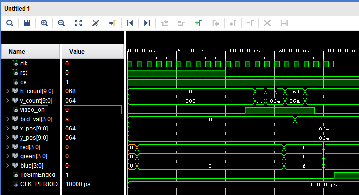

# DIGIT_DRAW Component

The `digit_draw` component translates a 4-bit BCD (Binary-Coded Decimal) value into RGB signals to render a digit on the VGA display. 

By comparing the current pixel coordinates (`h_count`, `v_count`) against a specified bounding box, 
it determines whether to output the digit's foreground color or a transparent/black background.

## Interface - [digit_draw.vhd](../components/digit_draw/src/digit_draw.vhd)

| Port Name  | Direction | Type                            | Description                                            |
|:-----------|:---------:|:--------------------------------|:-------------------------------------------------------|
| `clk`      |   Input   | `std_logic`                     | System clock.                                          |
| `rst`      |   Input   | `std_logic`                     | High-active synchronous reset.                         |
| `ce`       |   Input   | `std_logic`                     | Clock enable.                                          |
| `h_count`  |   Input   | `std_logic_vector (9 downto 0)` | Current pixel X coordinate.                            |
| `v_count`  |   Input   | `std_logic_vector (9 downto 0)` | Current pixel Y coordinate.                            |
| `video_on` |   Input   | `std_logic`                     | Active high in visible display area.                   |
| `bcd_val`  |   Input   | `std_logic_vector (3 downto 0)` | 4-bit BCD value to draw (0-9).                         |
| `x_pos`    |   Input   | `std_logic_vector (9 downto 0)` | X coordinate of the digit's top-left bounding box.     |
| `y_pos`    |   Input   | `std_logic_vector (9 downto 0)` | Y coordinate of the digit's top-left bounding box.     |
| `red`      |  Output   | `std_logic_vector (3 downto 0)` | 4-bit red channel.                                     |
| `green`    |  Output   | `std_logic_vector (3 downto 0)` | 4-bit green channel.                                   |
| `blue`     |  Output   | `std_logic_vector (3 downto 0)` | 4-bit blue channel.                                    |

## Functionality

* **Bounding Box**: Checks if the current pixel falls within the 24x48 area starting at `x_pos` and `y_pos`.
* **Font Rendering**: Reads digit pixel data from ROM in [`font_pkg.vhd`](../components/common/font_pkg.vhd). Active is white. Invalid BCD values (>9) default to '0'.
* **Blanking Protection**: If `video_on` is '0', the component strictly outputs black (`"0000"` for all channels).

## Simulated Output

Simulation demonstrating the rendering of the different BCD digits based on the `font_pkg` ROM data.

## Test Bench - [digit_draw_tb.vhd](../components/digit_draw/sim/digit_draw_tb.vhd)

