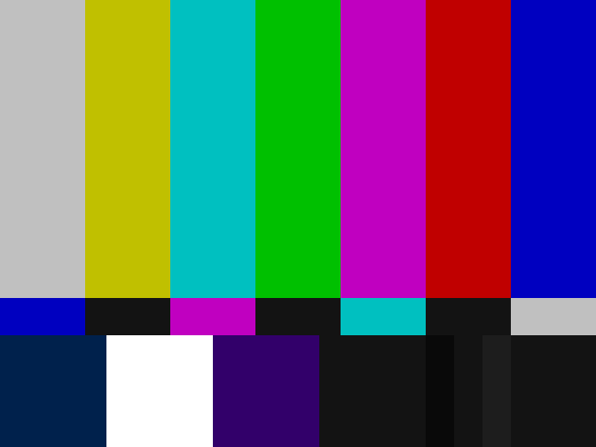
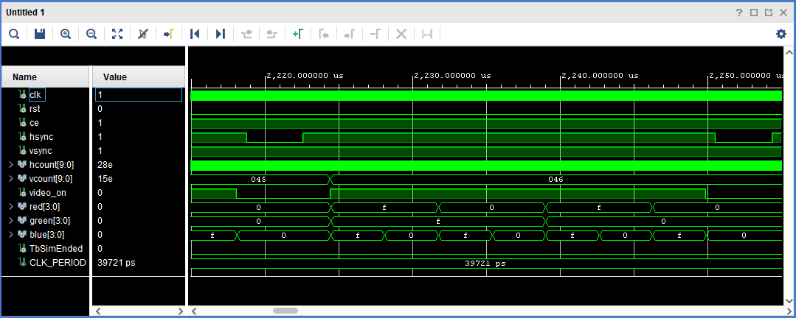
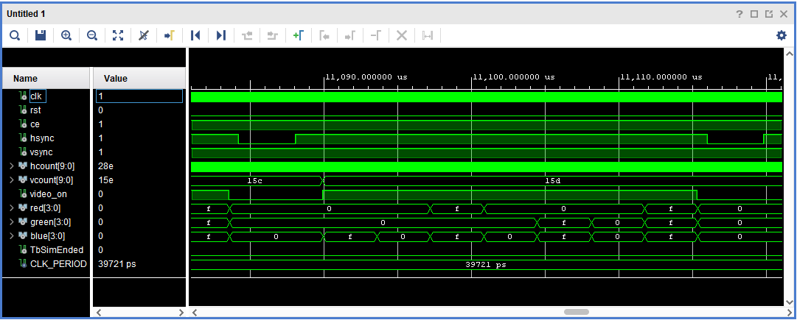
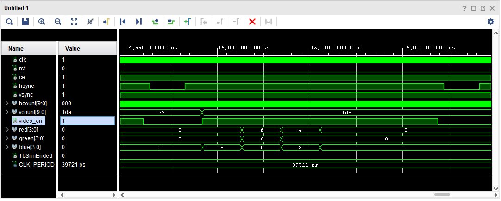

# IMG_GEN Component

The `img_gen` component is a diagnostic module. 
It generates a test pattern ([SMPTE Color Bars](https://en.wikipedia.org/wiki/SMPTE_color_bars)) 
to verify the functionality and timing of `vga_sync` and the VGA connection before game logic is implemented.

## Interface - [img_gen.vhd](../components/test_pattern/src/img_gen.vhd)

| Port Name  | Direction | Type                             | Description                                            |
|:-----------|:---------:|:---------------------------------|:-------------------------------------------------------|
| `clk`      |   Input   | `std_logic`                      | Main clock signal.                                     |
| `rst`      |   Input   | `std_logic`                      | High-active synchronous reset.                         |
| `ce`       |   Input   | `std_logic`                      | Clock enable signal.                                   |
| `h_count`  |   Input   | `std_logic_vector (9 downto 0)`  | Current horizontal pixel coordinate.                   |
| `v_count`  |   Input   | `std_logic_vector (9 downto 0)`  | Current vertical pixel coordinate.                     |
| `video_on` |   Input   | `std_logic`                      | Indicates if the current pixel is in the visible area. |
| `red`      |  Output   | `std_logic_vector (3 downto 0)`  | 4-bit red color channel.                               |
| `green`    |  Output   | `std_logic_vector (3 downto 0)`  | 4-bit green color channel.                             |
| `blue`     |  Output   | `std_logic_vector (3 downto 0)`  | 4-bit blue color channel.                              |

## Functionality

* **Coordinate Processing**: Reads the current `h_count` and `v_count` values provided by the synchronization module.
* **Test Pattern Generation**: Divides the 640x480 screen into three horizontal sections to recreate SMPTE color bars
* **Blanking Protection**: If `video_on` is '0', the component outputs a black color (`"0000"` for all channels)
to prevent drawing during the blanking intervals, which could otherwise interfere with display synchronization.

### Pattern Layout

* **Top Section (67%)**: Displays 7 vertical bars (White, Yellow, Cyan, Green, Magenta, Red, Blue).
* **Middle Section (8%)**: Displays a castellated pattern of Blue, Black, Magenta, Black, Cyan, Black, and White.
* **Bottom Section (25%)**: Displays specific diagnostic bars including -I, White, Q, and Black.

## Test Bench - [img_gen_tb.vhd](../components/test_pattern/sim/img_gen_tb.vhd)

### Top Section Test

### Middle Section Test

### Bottom Section Test

