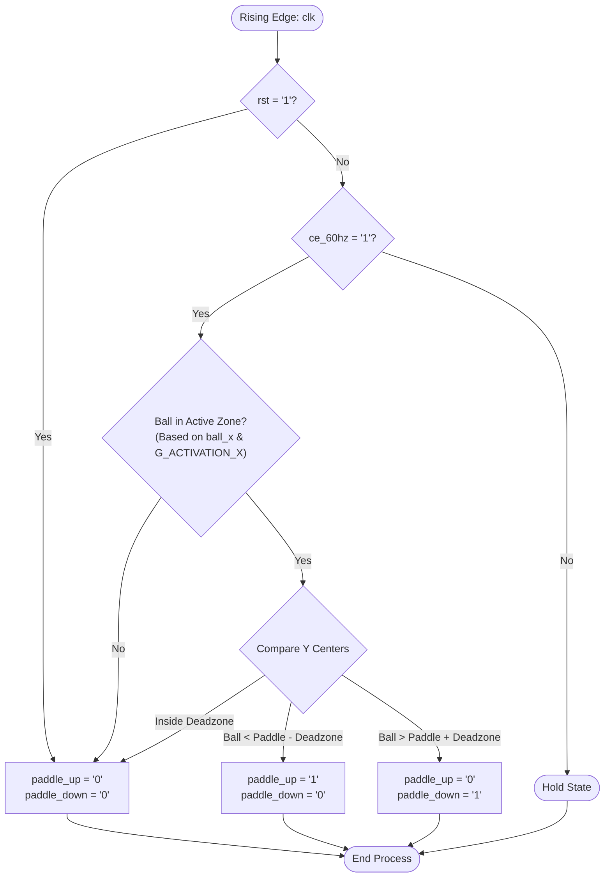
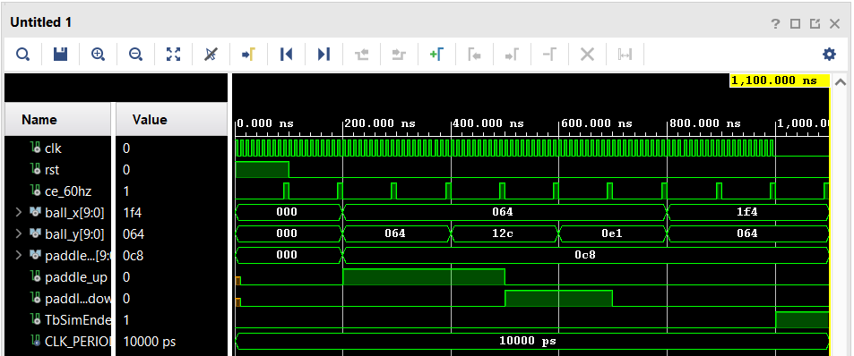

# PONG_AI Component

The `pong_ai` component serves as an automated opponent for the Pong game.
It calculates the difference between the ball and the paddle, then sends commands to keep the paddle aligned with the ball.

The AI is aware of its position on the screen and uses an activation boundary to remain inactive until the ball enters its defensive zone.

## Interface - [pong_ai.vhd](../components/pong_ai/src/pong_ai.vhd)

### Generics
| Generic Name     | Type      | Description                                                                 |
|:-----------------|:---------:|:----------------------------------------------------------------------------|
| `G_PADDLE_X`     | `integer` | Physical X position of the paddle. Used to determine the AI's side.         |
| `G_ACTIVATION_X` | `integer` | The X-coordinate boundary where this AI wakes up and starts tracking.       |

### Ports
| Port Name     | Direction | Type                            | Description                                                |
|:--------------|:---------:|:--------------------------------|:-----------------------------------------------------------|
| `clk`         |   Input   | `std_logic`                     | Main system clock.                                         |
| `rst`         |   Input   | `std_logic`                     | Resets the AI outputs to their default state.              |
| `ce_60hz`     |   Input   | `std_logic`                     | Clock enable pulse (60 Hz) to synchronize with physics.    |
| `ball_x`      |   Input   | `std_logic_vector (9 downto 0)` | Current X coordinate of the ball.                          |
| `ball_y`      |   Input   | `std_logic_vector (9 downto 0)` | Current Y coordinate of the ball.                          |
| `paddle_y`    |   Input   | `std_logic_vector (9 downto 0)` | Current Y coordinate of the AI's paddle.                   |
| `paddle_up`   |  Output   | `std_logic`                     | Output signal simulating a player pressing "Up".           |
| `paddle_down` |  Output   | `std_logic`                     | Output signal simulating a player pressing "Down".         |

## Functionality

The `pong_ai` component tracks the ball and moves the paddle continuously. It evaluates the game state on every `ce_60hz` clock enable:

* **Side Detection:** Determines whether it guards the left or right side during synthesis by checking if `G_PADDLE_X` is on the left or right half of the screen.
* **Positional Activation:** The AI remains dormant unless the ball's X-coordinate (`ball_x`) has crossed the `G_ACTIVATION_X` boundary into the AI's defensive half.
* **Center Calculation:** Calculates the vertical center of both the ball (`sig_ball_center_y`) and the paddle (`sig_paddle_center_y`).
* **Deadzone Logic:** To prevent the paddle from "jittering" when it is almost aligned with the ball, a deadzone (`C_AI_DEADZONE`) is implemented.
* **Movement Execution:** 
    * If the ball's center is above the paddle's deadzone, `paddle_up` is turned on.
    * If the ball's center is below the paddle's deadzone, `paddle_down` is turned on.
    * If the ball is within the deadzone, both signals are turned off.

*(Constants for this component are defined in [const_pkg.vhd](../components/common/const_pkg.vhd))*

## Logic Diagram

## Test Bench - [pong_ai_tb.vhd](../components/pong_ai/sim/pong_ai_tb.vhd)

