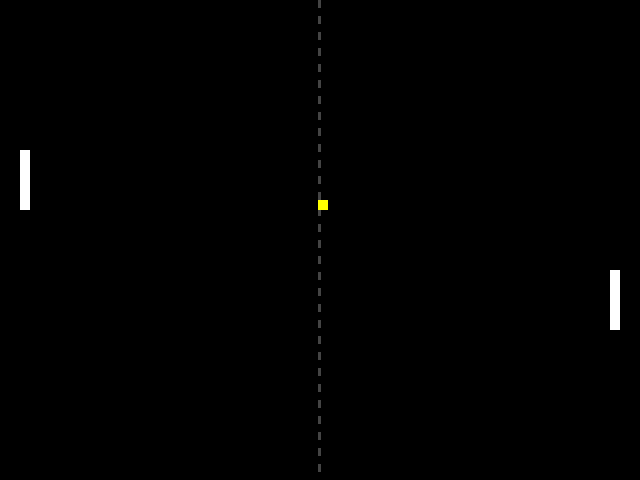
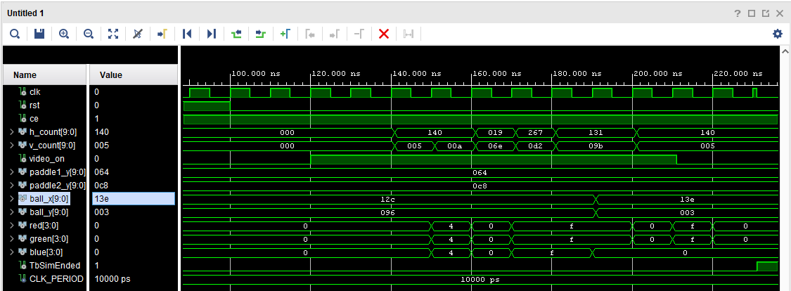

# PONG_DRAW Component

Translates game state into RGB signals. 
By comparing the current pixel coordinates (`h_count`, `v_count`) against object boundaries, it determines the exact pixel colors to output to the VGA display.

## Interface - [pong_draw.vhd](../components/pong_draw/src/pong_draw.vhd)

| Port Name   | Dir | Type                            | Description                              |
|:------------|:---:|:--------------------------------|:-----------------------------------------|
| `clk`       | In  | `std_logic`                     | System clock.                            |
| `rst`       | In  | `std_logic`                     | Asynchronous reset.                      |
| `ce`        | In  | `std_logic`                     | Clock enable.                            |
| `h_count`   | In  | `std_logic_vector (9 downto 0)` | Current pixel X coordinate.              |
| `v_count`   | In  | `std_logic_vector (9 downto 0)` | Current pixel Y coordinate.              |
| `video_on`  | In  | `std_logic`                     | Active high in visible display area.     |
| `paddle1_y` | In  | `std_logic_vector (9 downto 0)` | Player 1 paddle Y coordinate.            |
| `paddle2_y` | In  | `std_logic_vector (9 downto 0)` | Player 2 paddle Y coordinate.            |
| `ball_x`    | In  | `std_logic_vector (9 downto 0)` | Ball X coordinate.                       |
| `ball_y`    | In  | `std_logic_vector (9 downto 0)` | Ball Y coordinate.                       |
| `red`       | Out | `std_logic_vector (3 downto 0)` | 4-bit red channel.                       |
| `green`     | Out | `std_logic_vector (3 downto 0)` | 4-bit green channel.                     |
| `blue`      | Out | `std_logic_vector (3 downto 0)` | 4-bit blue channel.                      |

## Rendering Logic

Rendering evaluates synchronously when `video_on = '1'`. Elements are drawn in the following Z-order (bottom to top):

1.  **Background:** Black (`0000`, `0000`, `0000`) default fallback.
2.  **Center Line:** Dashed gray (`0100`, `0100`, `0100`). Dashed effect derived via `v_pos mod 16 < 8`.
3.  **Paddles:** Solid white (`1111`, `1111`, `1111`) at fixed X offsets and dynamic Y inputs.
4.  **Ball:** Solid yellow (`1111`, `1111`, `0000`). Rendered last to guarantee it overlaps the center line.

**Blanking Intervals:** When `video_on = '0'`, RGB outputs are strictly driven to zero to prevent monitor desynchronization.

## Simulated Output

Simulation demonstrating the rendering of Pong elements based on inputs.

## Test Bench - [pong_draw_tb.vhd](../components/pong_draw/sim/pong_draw_tb.vhd)

