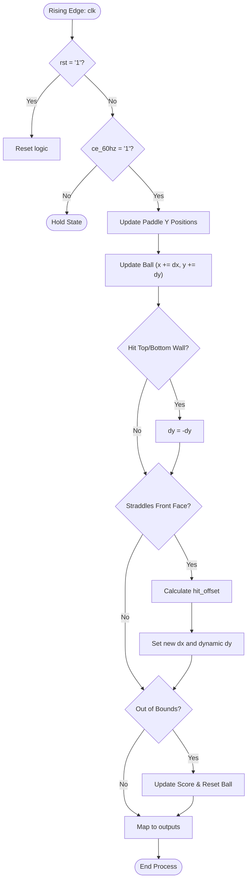

# PONG_PHYSICS Component

The `pong_physics` component serves as the central game engine.
It manages the states, coordinates, collision logic, and scoring of the game, independent of graphical rendering.

## Interface - [pong_physics.vhd](../components/pong_physics/src/pong_physics.vhd)

| Port Name   | Direction | Type                            | Description                                             |
|:------------|:---------:|:--------------------------------|:--------------------------------------------------------|
| `clk`       |   Input   | `std_logic`                     | Main system clock.                                      |
| `rst`       |   Input   | `std_logic`                     | Resets the ball, paddles, and score to starting values. |
| `ce_60hz`   |   Input   | `std_logic`                     | Clock enable pulse (60 Hz) to update physics frames.    |
| `p1_up`     |   Input   | `std_logic`                     | Player 1 input to move the paddle up.                   |
| `p1_down`   |   Input   | `std_logic`                     | Player 1 input to move the paddle down.                 |
| `p2_up`     |   Input   | `std_logic`                     | Player 2 input to move the paddle up.                   |
| `p2_down`   |   Input   | `std_logic`                     | Player 2 input to move the paddle down.                 |
| `paddle1_y` |  Output   | `std_logic_vector (9 downto 0)` | Current Y coordinate of Player 1's paddle.              |
| `paddle2_y` |  Output   | `std_logic_vector (9 downto 0)` | Current Y coordinate of Player 2's paddle.              |
| `ball_x`    |  Output   | `std_logic_vector (9 downto 0)` | Current X coordinate of the ball.                       |
| `ball_y`    |  Output   | `std_logic_vector (9 downto 0)` | Current Y coordinate of the ball.                       |
| `score_p1`  |  Output   | `std_logic_vector (7 downto 0)` | Player 1's current score.                               |
| `score_p2`  |  Output   | `std_logic_vector (7 downto 0)` | Player 2's current score.                               |

## Functionality

The `pong_physics` component drives the main gameplay loop on the `ce_60hz` clock enable signal:

* **Paddle Movement:** Updates coordinates (`paddle1_y` and `paddle2_y`) based on player inputs, constrained within screen bounds accounting for paddle speed to prevent off-screen rendering.
* **Ball Trajectory:** Updates ball coordinates (`ball_x` and `ball_y`) every frame using X and Y velocity vectors. Handles safe type conversion for out-of-bounds rendering.
* **Wall Collision:** Inverts the ball's vertical velocity if it hits the top (`<= 0`) or bottom (`>= V_DISPLAY`) edges.
* **Paddle Collision & Rebound:** Uses a Front-Face AABB intersection check. When hit it calculates the impact point to change the ball's reflection angle.
* **Scoring:** If the ball moves past a paddle (`< 0` or `> H_DISPLAY`), a point is awarded, and the ball resets to the center.

*(Constants for this component are defined in [const_pkg.vhd](../components/common/const_pkg.vhd))*

### Front-Face AABB Collision with Dynamic Rebound

To prevent "Ghost Bounces" or the ball getting trapped inside the paddle, collision detection relies on strict front-face intersection logic.

An intersection occurs when:
1. The ball's bounding box straddles the plane of the paddle's front face (`ball.left <= paddle_front` AND `ball.right >= paddle_front`).
2. The ball overlaps with the paddle's vertical dimensions.
3. The ball is traveling *towards* the paddle (`ball.dx` is `< 0` for P1, `> 0` for P2).

When a valid collision occurs, the engine calculates a `hit_offset`—the distance between the center of the ball and the center of the paddle. Based on this offset, the ball's vertical velocity (`dy`) is adjusted into one of five angular segments:
* **Outer Edges:** Sharp vertical angles.
* **Middle Sections:** Shallow vertical angles.
* **Dead Center:** Straight horizontal trajectory (`dy = 0`).

## Logic Diagram

## Test Bench - [pong_physics_tb.vhd](../components/pong_physics/sim/pong_physics_tb.vhd)

