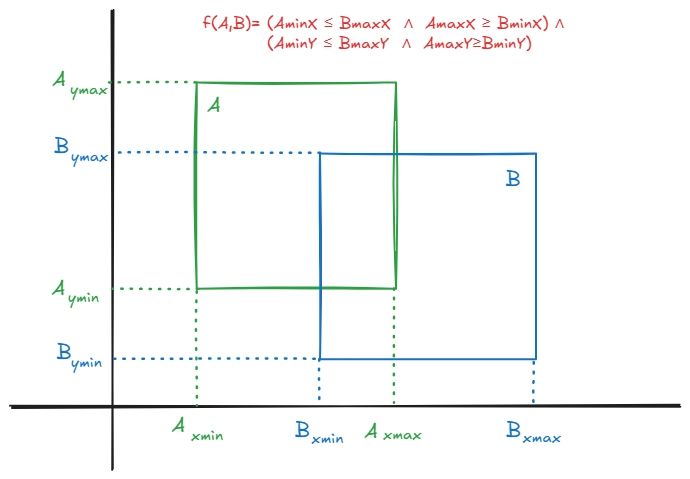
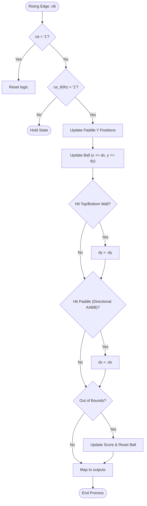
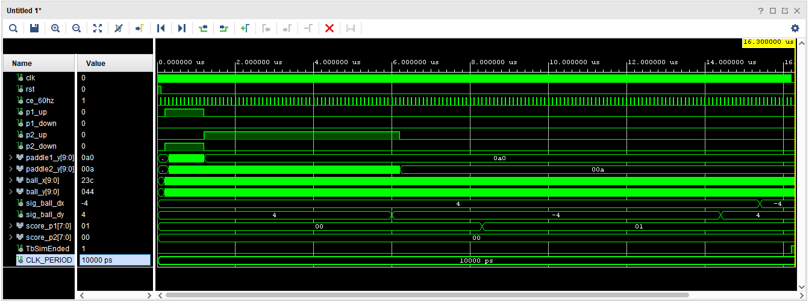

# PONG_PHYSICS Component

The `pong_physics` component serves as the central game engine.
It manages the states, coordinates, collision logic, and scoring of the game, independent of graphical rendering.

## Interface - [pong_physics.vhd](../components/pong_physics/src/pong_physics.vhd)

| Port Name   | Direction | Type                            | Description                                             |
|:------------|:---------:|:--------------------------------|:--------------------------------------------------------|
| `clk`       |   Input   | `std_logic`                     | Main system clock.                                      |
| `rst`       |   Input   | `std_logic`                     | Resets the ball, paddles, and score to starting values. |
| `ce_60hz`   |   Input   | `std_logic`                     | Clock enable pulse (60 Hz) to update physics frames.    |
| `p1_up`     |   Input   | `std_logic`                     | Player 1 input to move the paddle up.                   |
| `p1_down`   |   Input   | `std_logic`                     | Player 1 input to move the paddle down.                 |
| `p2_up`     |   Input   | `std_logic`                     | Player 2 input to move the paddle up.                   |
| `p2_down`   |   Input   | `std_logic`                     | Player 2 input to move the paddle down.                 |
| `paddle1_y` |  Output   | `std_logic_vector (9 downto 0)` | Current Y coordinate of Player 1's paddle.              |
| `paddle2_y` |  Output   | `std_logic_vector (9 downto 0)` | Current Y coordinate of Player 2's paddle.              |
| `ball_x`    |  Output   | `std_logic_vector (9 downto 0)` | Current X coordinate of the ball.                       |
| `ball_y`    |  Output   | `std_logic_vector (9 downto 0)` | Current Y coordinate of the ball.                       |
| `score_p1`  |  Output   | `std_logic_vector (7 downto 0)` | Player 1's current score.                               |
| `score_p2`  |  Output   | `std_logic_vector (7 downto 0)` | Player 2's current score.                               |

## Functionality

The `pong_physics` component drives the main gameplay loop on the `ce_60hz` clock enable signal:

* **Paddle Movement:** Updates coordinates (`paddle1_y` and `paddle2_y`) based on player inputs, constrained within screen bounds accounting for paddle speed to prevent off-screen rendering.
* **Ball Trajectory:** Updates ball coordinates (`ball_x` and `ball_y`) every frame using X and Y velocity vectors. Handles safe type conversion for out-of-bounds rendering.
* **Wall Collision:** Inverts the ball's vertical velocity if it hits the top (`<= 0`) or bottom (`>= V_DISPLAY`) edges.
* **Paddle Collision:** Uses a directional AABB check for intersections between the ball and paddles. Inverts horizontal velocity on hit.
* **Scoring:** If the ball moves past a paddle (`< 0` or `> H_DISPLAY`), a point is awarded, and the ball resets to the center.

*(Constants for this component are defined in [const_pkg.vhd](../components/common/const_pkg.vhd))*

### Directional Axis-Aligned Bounding Box (AABB) Collision

AABB collision detection determines if two 2D, non-rotated rectangles overlap by projecting their boundaries onto the X and Y axes.

The directional checks prevent a "Ghost Bounce" glitch where a player could catch a ball that had already passed them.

In `pong_physics`, an intersection occurs when the ball and a paddle overlap on both the X and Y axes simultaneously **AND** the ball is traveling *towards* the paddle:
* `ball.left <= paddle.right` AND `ball.right >= paddle.left`
* `ball.top <= paddle.bottom` AND `ball.bottom >= paddle.top`
* `ball.dx` is moving towards the paddle (`< 0` for Player 1, `> 0` for Player 2)

## Logic Diagram

## Test Bench - [pong_physics_tb.vhd](../components/pong_physics/sim/pong_physics_tb.vhd)

