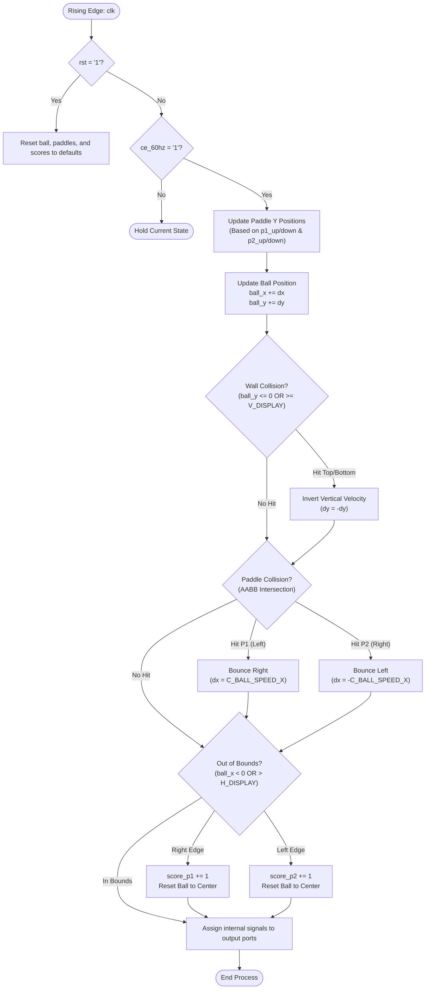

# PONG_PHYSICS Component

The `pong_physics` component serves as the central game engine. 
It manages the states, coordinates, collision logic, and scoring of the game, completely independent of any graphical rendering.

## Interface - [pong_physics.vhd](../components/pong_physics/src/pong_physics.vhd)

| Port Name   | Direction | Type                            | Description                                             |
|:------------|:---------:|:--------------------------------|:--------------------------------------------------------|
| `clk`       |   Input   | `std_logic`                     | Main system clock.                                      |
| `rst`       |   Input   | `std_logic`                     | Resets the ball, paddles, and score to starting values. |
| `ce_60hz`   |   Input   | `std_logic`                     | Clock enable pulse (60 Hz) to update physics frames.    |
| `p1_up`     |   Input   | `std_logic`                     | Player 1 input to move the paddle up.                   |
| `p1_down`   |   Input   | `std_logic`                     | Player 1 input to move the paddle down.                 |
| `p2_up`     |   Input   | `std_logic`                     | Player 2 input to move the paddle up.                   |
| `p2_down`   |   Input   | `std_logic`                     | Player 2 input to move the paddle down.                 |
| `paddle1_y` |  Output   | `std_logic_vector (9 downto 0)` | Current Y coordinate of Player 1's paddle.              |
| `paddle2_y` |  Output   | `std_logic_vector (9 downto 0)` | Current Y coordinate of Player 2's paddle.              |
| `ball_x`    |  Output   | `std_logic_vector (9 downto 0)` | Current X coordinate of the ball.                       |
| `ball_y`    |  Output   | `std_logic_vector (9 downto 0)` | Current Y coordinate of the ball.                       |
| `score_p1`  |  Output   | `std_logic_vector (7 downto 0)` | Player 1's current score.                               |
| `score_p2`  |  Output   | `std_logic_vector (7 downto 0)` | Player 2's current score.                               |

## Functionality

The `pong_physics` component drives the main gameplay loop on `ce_60hz` clock enable signal. It handles the following core mechanics:

* **Paddle Movement:** Updates coordinates (`paddle1_y` and `paddle2_y`) on inputs from the players. Each paddle moves up or down by a fixed amount, constrained within the screen bounds.
* **Ball Trajectory:** The ball's coordinates (`ball_x` and `ball_y`) are updated every frame by adding the current X and Y velocity vectors.
* **Wall Collision Detection:** If the ball reaches the top (`<= 0`) or bottom (`>= V_DISPLAY`) edges of the screen, its vertical velocity is inverted.
* **Paddle Collision Detection:** Uses AABB to check if the ball intersects with any of the paddles. On collision the horizontal velocity is inverted.
* **Score & Out of Bounds:** If the ball moves past a paddle and leaves the screen (`< 0` or `> H_DISPLAY`), a point is added to the other player. The ball position is reset back to center.

Constants for this component can be found in the [const_pkg.vhd](../components/common/const_pkg.vhd) package

### Axis-Aligned Bounding Box (AABB) Collision

AABB (Axis-Aligned Bounding Box) is a collision detection algorithm used to determine if two 2D, non-rotated rectangles overlap.
It works by projecting the boundaries of both objects onto the X and Y axes and checking for gaps.

In `pong_physics`, an AABB collision occurs when the ball and a paddle intersect. If **all** the following conditions happen simultaneously:
1. The ball's left edge is less than or equal to the paddle's right edge.
2. The ball's right edge is greater than or equal to the paddle's left edge.
3. The ball's top edge is less than or equal to the paddle's bottom edge.
4. The ball's bottom edge is greater than or equal to the paddle's top edge.

## Logic Diagram

## Test Bench - [pong_physics_tb.vhd](../components/pong_physics/sim/pong_physics_tb.vhd)

