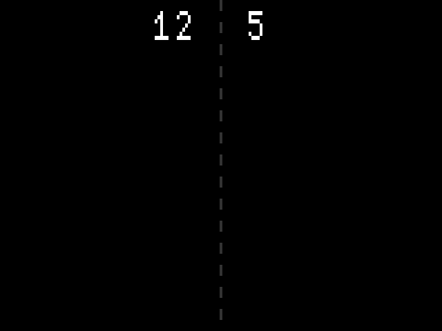
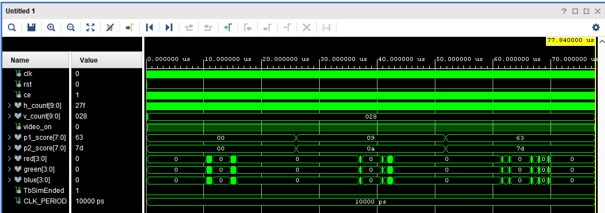

# SCORE_DRAW Component

The `score_draw` component manages the conversion and rendering of two 8-bit player scores onto the VGA display. 

It uses the `bin2bcd` component to convert binary score values into BCD digits, and has multiple `digit_draw` components to render the hundreds, tens, and ones digits for each player.

It also handles dynamic positions and leading zeros.

## Interface - [score_draw.vhd](../components/score_draw/src/score_draw.vhd)

| Port Name  | Direction | Type                            | Description                                            |
|:-----------|:---------:|:--------------------------------|:-------------------------------------------------------|
| `clk`      |   Input   | `std_logic`                     | System clock.                                          |
| `rst`      |   Input   | `std_logic`                     | High-active synchronous reset.                         |
| `ce`       |   Input   | `std_logic`                     | Clock enable.                                          |
| `h_count`  |   Input   | `std_logic_vector (9 downto 0)` | Current pixel X coordinate.                            |
| `v_count`  |   Input   | `std_logic_vector (9 downto 0)` | Current pixel Y coordinate.                            |
| `video_on` |   Input   | `std_logic`                     | Active high in visible display area.                   |
| `p1_score` |   Input   | `std_logic_vector (7 downto 0)` | Player 1 score in 8-bit binary format.                 |
| `p2_score` |   Input   | `std_logic_vector (7 downto 0)` | Player 2 score in 8-bit binary format.                 |
| `red`      |  Output   | `std_logic_vector (3 downto 0)` | 4-bit red channel output.                              |
| `green`    |  Output   | `std_logic_vector (3 downto 0)` | 4-bit green channel output.                            |
| `blue`     |  Output   | `std_logic_vector (3 downto 0)` | 4-bit blue channel output.                             |

## Functionality

* **Binary to BCD Conversion**: Converts the 8-bit binary inputs `p1_score` and `p2_score` into BCD format (Hundreds, Tens, Ones) using `bin2bcd` component.
* **Dynamic Positioning & Leading Zero Suppression**:
    * The inactive leading digits are assigned off-screen coordinates (`others => '1'`).
    * Player 1 digits are left-to-right with the "ones" at the center. Player 2 digits adjust position so the most significant digit is at the center line.
* **RGB Output Combiner**: The `score_draw` component has six `digit_draw` (three per player). The output color is set by OR-ing the RGB channels of all of them.

## Simulated Output

Simulation demonstrating the rendering of the player scores on the screen.

## Test Bench - [score_draw_tb.vhd](../components/score_draw/sim/score_draw_tb.vhd)

