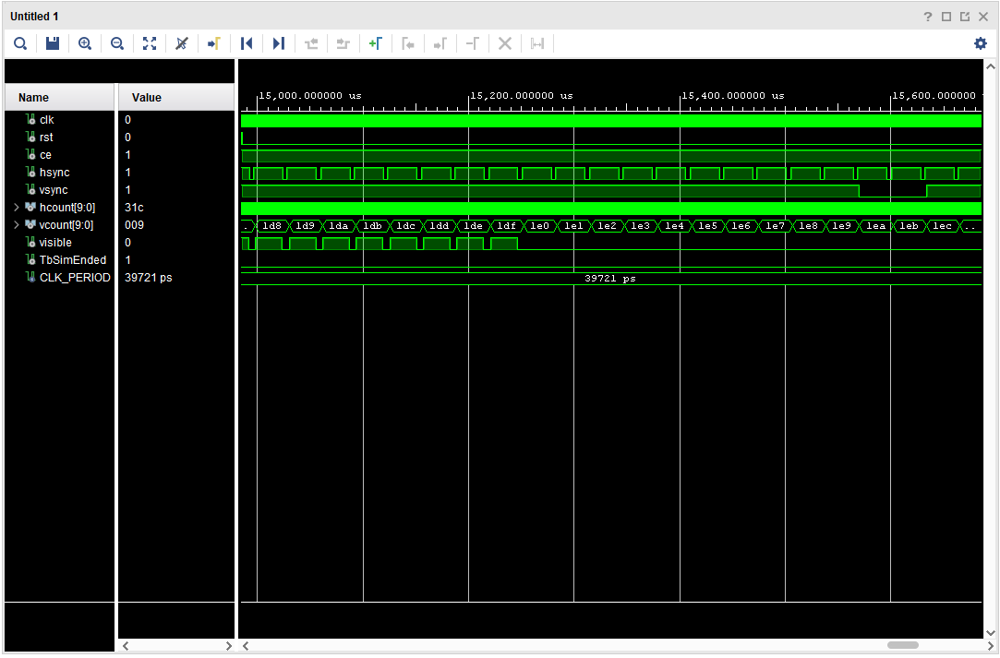

# VGA_SYNC COMPONENT

The `vga_sync` component is responsible for generating the horizontal and vertical synchronization signals required to drive a VGA display.

### Interface

#### Inputs:
- `clk`: The clock signal used to drive the synchronization logic.
- `rst`: The reset signal to initialize the synchronization logic.
- `ce`: The clock enable signal to control the timing of the synchronization signals.

#### Outputs:
- `hsync`: The horizontal synchronization signal.
- `vsync`: The vertical synchronization signal.
- `hcount`: A 10-bit output representing the current horizontal pixel count.
- `vcount`: A 10-bit output representing the current vertical pixel count.
- `video_on`: A signal indicating whether the video output should be active (i.e., within the visible area of the display).

### Functionality

The `vga_sync` component generates the necessary timing signals for a VGA display.
It counts the horizontal and vertical pixels to determine when to assert the `hsync` and `vsync` signals.
The `video_on` signal is asserted when the current pixel count is within the visible area of the display, allowing other components to generate RGB signals accordingly.

### Test Bench

