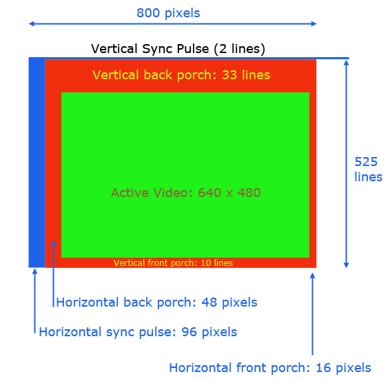

# VGA_SYNC Component

The `vga_sync` component is the foundational building block of the entire project. 
It is responsible for generating the horizontal and vertical synchronization signals required to drive a standard VGA display,
acting as the system's timing and coordinate generator.

## Interface - [vga_sync.vhd](../components/vga_sync/src/vga_sync.vhd)

| Port Name  | Direction | Type                            | Description                                                      |
|:-----------|:---------:|:--------------------------------|:-----------------------------------------------------------------|
| `clk`      |   Input   | `std_logic`                     | The clock signal.                                                |
| `rst`      |   Input   | `std_logic`                     | The reset signal.                                                |
| `ce`       |   Input   | `std_logic`                     | The clock enable signal.                                         |
| `hsync`    |  Output   | `std_logic`                     | The horizontal synchronization signal.                           |
| `vsync`    |  Output   | `std_logic`                     | The vertical synchronization signal.                             |
| `hcount`   |  Output   | `std_logic_vector (9 downto 0)` | A 10-bit output representing the current horizontal pixel count. |
| `vcount`   |  Output   | `std_logic_vector (9 downto 0)` | A 10-bit output representing the current vertical pixel count.   |
| `video_on` |  Output   | `std_logic`                     | A signal indicating we are within the visible area.              |

## Functionality

The `vga_sync` component generates timing signals for a VGA display.
1. It counts the horizontal and vertical pixels to determine when to assert the `hsync` and `vsync` signals based on VGA timing intervals (Front Porch, Sync Pulse, Back Porch).
2. The `video_on` signal is asserted when the current pixel count is strictly within the visible area of the display.
3. This allows downstream components (like [img_gen](IMG_GEN.md) or [pong_draw](PONG_DRAW.md)) to know which pixel is currently being rendered and generate RGB signals accordingly.

## Timing Diagram

The timing diagram below illustrates the relationship between the `hsync`, `vsync`, and pixel counts (`hcount`, `vcount`), as well as the `video_on` signal

These values can be found in the [const_pkg.vhd](../components/common/const_pkg.vhd) package

## Test Bench - [vga_sync_tb.vhd](../components/vga_sync/sim/vga_sync_tb.vhd)

Simulation verifying the correct timing of the `hsync` and `vsync` pulses:

