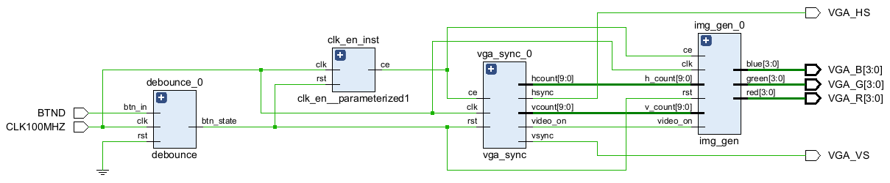
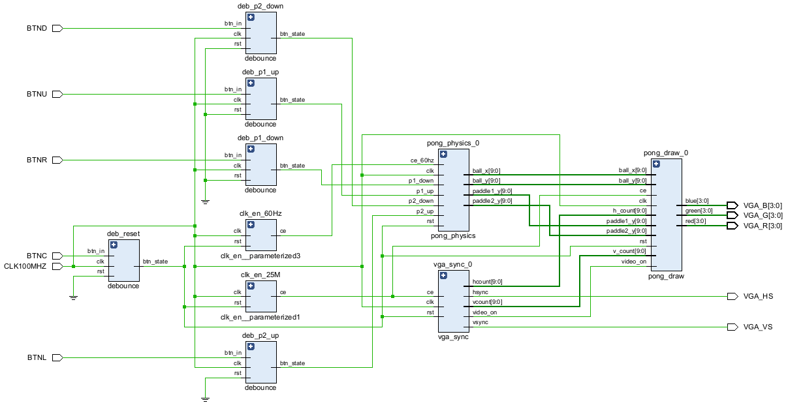

# vga_vhdl

    
    

## Team Members
* **[Tomáš Lohynský](https://github.com/Tomer27cz) (270965)** - Team leader, overall architectural design, VHDL implementation, and integration
* **[Jan Tříletý](https://github.com/TriletyJ) (270374)** - Project documentation (README), poster design, and final presentation preparation

## Main Goal
The main objective of this project is the design and VHDL implementation of a functional **VGA Controller**.
The system generates all hardware synchronization signals necessary for a standard VGA monitor and translates internal logic into an RGB video output.

Two switchable modes are implemented:
* **Static Graphics Test:** SMPTE Color Bars generator to verify proper display calibration and signal timing
* **Interactive Game:** Implementation of the game Pong, featuring movement physics, bounce logic, and rendering

## Functionality and Features
* **VGA Control:** Generation of `HSYNC` and `VSYNC` signals for standard VGA resolution (640x480 @ 60Hz)
* **Pixel Tracking:** Calculation of the current `x` and `y` pixel coordinates
* **Game Physics (Pong):** Ball movement, paddle control, wall bouncing, and collision detection
* **Switchable Architecture:** Separated top-level modules allow for easy compilation switching between the static test pattern and the actual game during development

## Top-Level Schematic

### Pattern Only Top Level:

### Pong Only Top Level:

## Hardware Interface (I/O Description)

| Signal Name | FPGA Pin       | Direction | Description                                      |
|:------------|:---------------|:---------:|:-------------------------------------------------|
| `CLK100MHZ` | E3             |   Input   | Main system clock (100 MHz)                      |
| `BTNC`      | N17            |   Input   | System reset                                     |
| `BTNU`      | M18            |   Input   | Player 1 paddle control - move up (`P1_UP`)      |
| `BTNR`      | M17            |   Input   | Player 1 paddle control - move down (`P1_DOWN`)  |
| `BTNL`      | P17            |   Input   | Player 2 paddle control - move up (`P2_UP`)      |
| `BTND`      | P18            |   Input   | Player 2 paddle control - move down (`P2_DOWN`)  |
| `VGA_HS`    | B11            |  Output   | Horizontal synchronization pulse for the monitor |
| `VGA_VS`    | B12            |  Output   | Vertical synchronization pulse for the monitor   |
| `VGA_R`     | A3, B4, C5, A4 |  Output   | Red color channel (RGB)                          |
| `VGA_G`     | C6, A5, B6, A6 |  Output   | Green color channel (RGB)                        |
| `VGA_B`     | B7, C7, D7, D8 |  Output   | Blue color channel (RGB)                         |

## Components Documentation

Detailed documentation, interfaces, and testbenches for individual modules can be found in their respective files:

* **[vga_sync](.github/VGA_SYNC.md):** Horizontal and vertical synchronization signals and tracking pixel coordinates
* **[img_gen](.github/IMG_GEN.md):** Generates a test pattern (SMPTE Color Bars) to verify the display output.
* **[pong_physics](.github/PONG_PHYSICS.md):** Implements game logic, ball movement, and collision detection.
* **[pong_draw](.github/PONG_DRAW.md):** Generates the RGB signals based on the physics engine's coordinates to render the game.

## Top-Level Integration

* `pattern_only.vhd`: Connects `vga_sync` and `img_gen`.
* `pong_only.vhd`: Connects `vga_sync`, `pong_physics`, and `pong_draw`.
* `vga_top.vhd`: Using a multiplexer, we can toggle between displaying the test pattern and the Pong game.

## Physical Setup

- TODO: add image