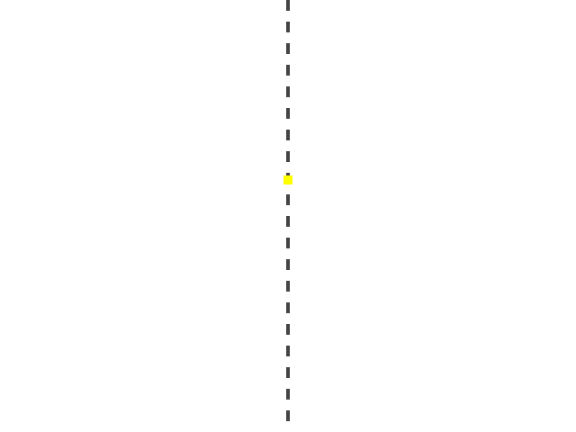
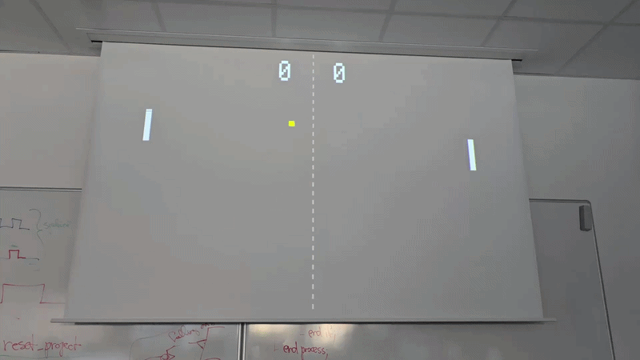
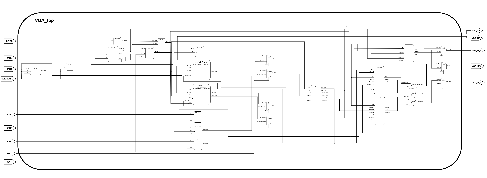
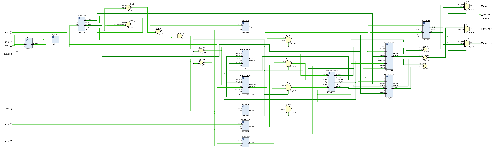
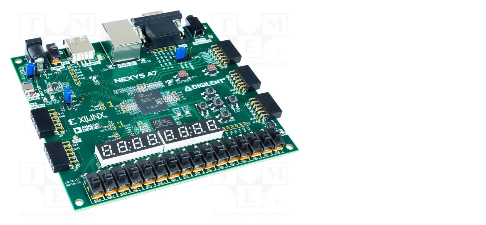
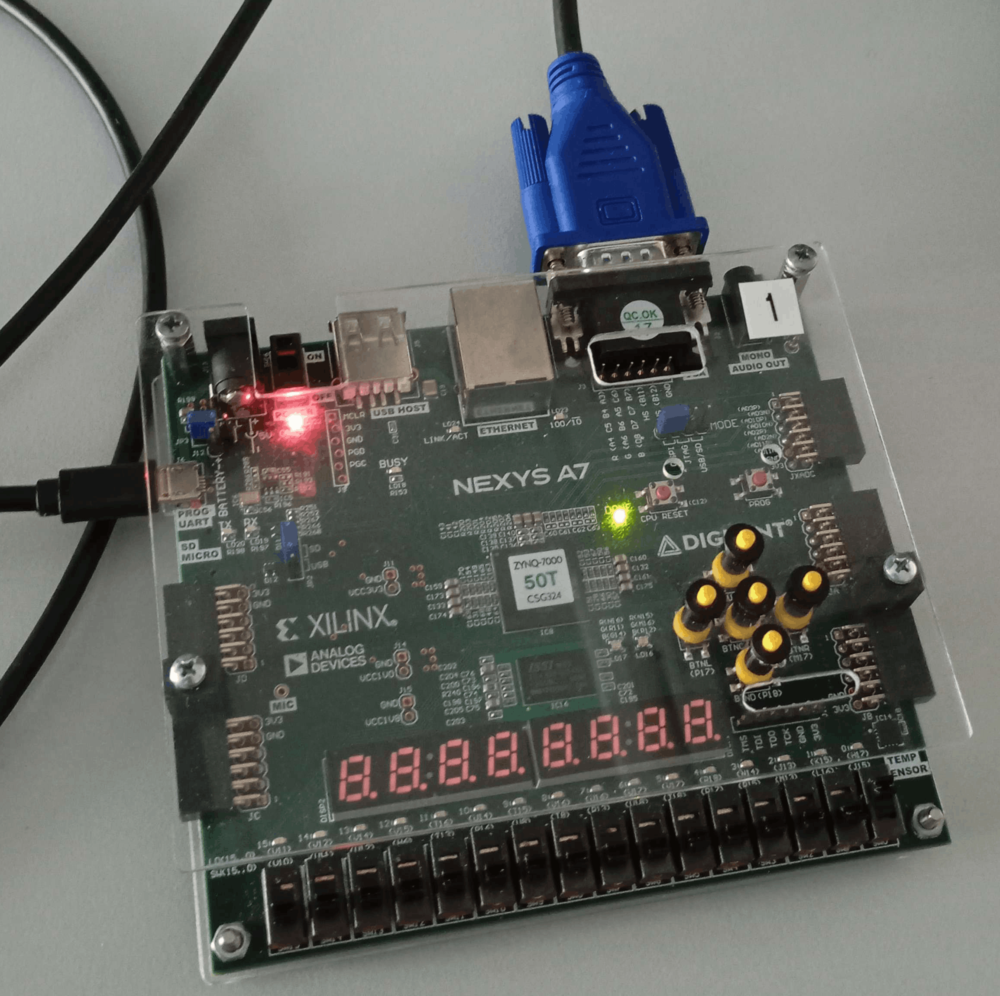
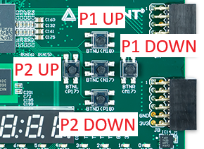

# vga_vhdl

    
    

## Team Members
* **[Tomáš Lohynský](https://github.com/Tomer27cz) (270965)** - Team leader, overall architectural design, VHDL implementation, and integration
* **[Jan Tříletý](https://github.com/TriletyJ) (270374)** - Project documentation (README), poster design, and final presentation preparation

## Main Goal
Design and implement a functional **VGA Controller** in VHDL.
The system generates hardware synchronization signals for a standard VGA monitor and translates internal logic into an RGB video output.

Multiple switchable modes are implemented to demonstrate the controller's capabilities:
* **Static Graphics Test:** SMPTE Color Bars generator to verify display calibration.
* **Pong Game:** A simple Pong game with two-player controls and real-time score display.
* **Single Player Mode:** An AI opponent that tracks the ball for a single-player experience.

## Functionality and Features
* **VGA Control:** Generates `HSYNC` and `VSYNC` signals for standard VGA resolution (640x480 @ 60Hz).
* **Pixel Tracking:** Calculates current `x` and `y` pixel coordinates.
* **Game Physics (Pong):** Ball movement, paddle control, wall bouncing, and collision detection.
* **AI Opponent:** An automated opponent logic block that tracks the ball and plays against the user.
* **Score Display:** Real-time score tracking and rendering on the VGA output.
* **Modular Design:** Individual components for synchronization, graphics generation, game physics, and score rendering.

## Pong Gameplay Demonstration

Gif demonstration of the Pong game mode, showcasing two-AI gameplay

## Top-Level Schematic [PDF Version](.github/img/schematic/vga_schematic.pdf)

### Vivado Schematic [PDF Version](.github/img/schematic/vivado/vga_schematic.pdf)

#### Component test schematic: [Pattern Schematic](.github/img/schematic/vivado/pattern_top_schematic.png), [Pong Schematic](.github/img/schematic/vivado/pong_top_schematic.png)

## Hardware Interface (I/O Description)

*Note: The directional button mappings for the paddles are currently mapped across the Nexys A7 directional cross.*

| Signal Name | FPGA Pin       | Direction | Description                                      |
|:------------|:---------------|:---------:|:-------------------------------------------------|
| `CLK100MHZ` | E3             |   Input   | Main system clock (100 MHz)                      |
| `BTNC`      | N17            |   Input   | System reset                                     |
| `BTNU`      | M18            |   Input   | Player 1 move up (`P1_UP`)                       |
| `BTNR`      | M17            |   Input   | Player 1 move down (`P1_DOWN`)                   |
| `BTNL`      | P17            |   Input   | Player 2 move up (`P2_UP`)                       |
| `BTND`      | P18            |   Input   | Player 2 move down (`P2_DOWN`)                   |
| `SW`        | J15, L16, M13  |   Input   | Mode selection switches                          |
| `VGA_HS`    | B11            |  Output   | Horizontal synchronization pulse for the monitor |
| `VGA_VS`    | B12            |  Output   | Vertical synchronization pulse for the monitor   |
| `VGA_R`     | A3, B4, C5, A4 |  Output   | Red color channel (RGB)                          |
| `VGA_G`     | C6, A5, B6, A6 |  Output   | Green color channel (RGB)                        |
| `VGA_B`     | B7, C7, D7, D8 |  Output   | Blue color channel (RGB)                         |

## Components Documentation

Detailed documentation, interfaces, and testbenches for individual modules can be found in their respective files:

* **[vga_sync](.github/VGA_SYNC.md):** Synchronization signals and pixel coordinate tracking.
* **[img_gen](.github/IMG_GEN.md):** Generates a test pattern (SMPTE Color Bars).
* **[pong_physics](.github/PONG_PHYSICS.md):** Game logic, ball movement, and collision detection.
* **[pong_draw](.github/PONG_DRAW.md):** Generates RGB signals based on the physics engine's coordinates.
* **[pong_ai](.github/PONG_AI.md):** Automated opponent that tracks the ball for single-player functionality.
* **[bin2bcd](.github/BIN2BCD.md):** Converts binary score values to BCD format.
* **[digit_draw](.github/DIGIT_DRAW.md):** Renders BCD digits on the VGA display for score representation.
* **[score_draw](.github/SCORE_DRAW.md):** Combines `bin2bcd` and `digit_draw` to display player scores on the VGA output.

## Main Top-Level Integration
* [vga_top.vhd](top/vga/src/vga_top.vhd): Using a multiplexer, toggle between the test pattern and the Pong game (with or without AI).

### Component test Top-Level

* [pattern_only.vhd](top/pattern_only/src/pattern_only_top.vhd): Connects `vga_sync` and `img_gen`.
* [pong_only.vhd](top/pong_only/src/pong_only_top.vhd): Connects `vga_sync`, `pong_physics`, and `pong_draw`.
* [pong_single.vhd](top/pong_single/src/pong_single_top.vhd): Connects `vga_sync`, `pong_physics`, `pong_draw`, and `pong_ai` for single-player mode.
* [pong_score.vhd](top/pong_score/src/pong_score_top.vhd): Connects `vga_sync`, `pong_physics`, `pong_draw`, and `score_draw` to display scores on the VGA output.
* [pong_ai.vhd](top/pong_ai/src/pong_ai_top.vhd): Connects `vga_sync`, `pong_physics`, `pong_draw`, and `pong_ai` so two AI opponents play against each other.

## Physical Setup

The project is designed for the Digilent Nexys A7-50T FPGA board. Simply connect a VGA monitor to the board's VGA port.

[**Official documentation** of NEXYS A7-50T FPGA board](https://digilent.com/reference/programmable-logic/nexys-a7/start)

  

## User Manual

### 1. Connection

### 2. Controls
The game is controlled using the directional push buttons (button cross) on the Nexys A7. Note that the movement is split between the left/right and up/down buttons for two players.

| Player       | Action        | Button | Description                            |
|:-------------|:--------------|:------:|:---------------------------------------|
| **Global**   | **Reset**     | `BTNC` | Resets the game and ball to the center |
| **Player 1** | **Move Up**   | `BTNU` | Moves the left paddle up               |
| **Player 1** | **Move Down** | `BTNR` | Moves the left paddle down             |
| **Player 2** | **Move Up**   | `BTNL` | Moves the right paddle up              |
| **Player 2** | **Move Down** | `BTND` | Moves the right paddle down            |

#### Layout Visualization

### 3. Switching modes
- SW0: `ON/OFF` - Toggles between the pong game and the static test pattern (SMPTE Color Bars).
- SW1: `ON/OFF` - In Pong mode, toggles **Player 2** between human control (using `BTNL` and `BTND`) and AI control.
- SW2: `ON/OFF` - In Pong mode, toggles **Player 1** between human control (using `BTNU` and `BTNR`) and AI control.
### 4. Gameplay rules
The rules of Pong are straightforward and simple. This classic arcade game simulates table tennis, where you control your "paddle" and try to deflect the ball so that your opponent misses it.
#### 4.1. Objective
The goal is to score more points than your opponent by making the ball ***pass behind your opponent's paddle*** (out of bounds on their side).
#### 4.2. Gameplay
- **Paddle movement**: Players can only move their paddle vertically (up and down) to deflect the ball.
- **Bouncing**: The ball bounces off the top and bottom walls of the playfield and off both players' paddles.
- **Scoring**: If a player misses the ball and it goes off the screen on their side, the other player scores a point.
- **Serving**: After each point is scored, the ball is served to the side of the player who just scored.
